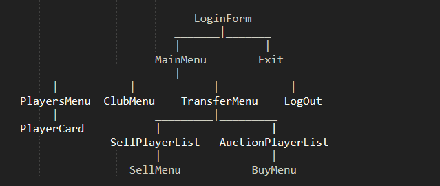
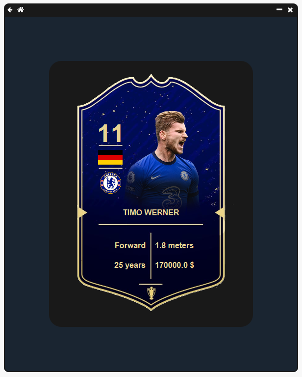
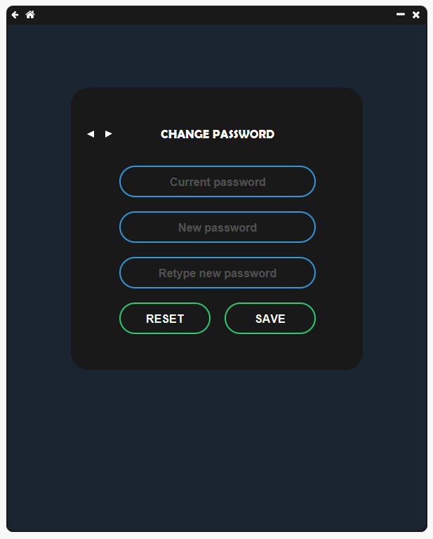

# FOOTBALL PLAYER DATABASE
Demo: https://www.youtube.com/watch?v=8O4gWr4d4DU
<!--https://user-images.githubusercontent.com/62663759/127275833-ac8d6b87-b64f-4839-865d-699ca6e83e60.mp4-->
<h5>
Description: 
Project name: Football Player Database System   
It is based on java networking. For the GUI part JavaFX, JFoenix and CSS is used. Scene builder is used to build the FXML files. And Intellij is used as Java IDE.  
Idea of the GUI is taken from: https://www.youtube.com/watch?v=HV7DtH3J2PU.  
IntelliJ IDEA Community Edition: https://www.jetbrains.com/idea/download/download-thanks.html?platform=windows&code=IIC  
Scene Builder: https://gluonhq.com/products/scene-builder/thanks/?dl=https://download2.gluonhq.com/scenebuilder/16.0.0/install/windows/SceneBuilder-16.0.0.msi  
Java SE 11: https://www.oracle.com/java/technologies/javase-jdk11-downloads.html  
JavaFX: https://gluonhq.com/products/javafx/  
JFoenix: http://www.jfoenix.com/  
</h5>

# SERVER
<h5> Server will read players data from a text file and store it to the database according to the club.
Every club has a playerlist and all the players of the database will be divided into them.
Server needs to be started at a specific port.
And password will be set for every club. Default password is "admin".
Club name and password will be mapped together using a ConcurrentHashMap to validate credentials.
Server will also contain a map of club name and its corresponding networkUtil.
Once a client connects to the server with valid credentials, server will create a networkUtil for that and map that to that client's club name.
And will start a read thread to receive data from that client.
For each client, server will create a network util and a read thread.
If client got disconnected from server, server will remove that client from clientMap.</h5>

# CLIENT
# UI STRUCTURE
<h5>
A data structure is maintained for ui to go from one scene to another. And keep track of current scene.      
</h5>

# LOGIN FORM
<h5>First of all login form will be shown to the user. There is two options.
Exit(to exit the program) and Login(to log in to database).
To enter into the player database system user have to enter valid club name and password.
When user hit the login button the client will connect to server using the ip address and port of the server.
Then the club name and password given by user will go to the server. Server will validate the credentials.
If the club name and password is valid then server will sent the corresponding club object to the client.
Also the auction player list will be sent to client as well.
And the user will prompt to the main menu. If the credentials are invalid then error will be shown to user.
Once the user has made it to the main menu, he can now do operations on the players of that club.</h5>

# MAIN MENU  
<h5>There are 4 options in the menu. Players, Club, Transfer and Log out.</h5>

# PLAYERS
<h5>In the players menu all the players of the club will be shown.
Under  the players list there is feature of filtering the list according to different attributes like player name,country,position,salary etc.
On clicking a players name, player's card with full details will be shown to the user.</h5>

# CLUB
<h5>In the club menu there is some info of the club like total yearly salary,country wise player count.</h5>

# TRANSFER
<h5>In the transfer menu users can change the player list of the club by selling/buying.</h5>

# SELL
<h5>To sell a player user need to choose from available players in the club and set a price tag for that player(Price must be a valid double number).
Once the user hit the sell button price will be set in the Player object. The club name and the player object will be sent to the server.
Server will remove the player from that club in the database and will add the player in auction player list. Then server will send the changed club to the client.
Also server will send the new auction player list to every client.</h5>

# BUY
<h5>To buy a player user needs to go to buy menu. There is the list of players on auction. User needs to choose a player from that.
Then the player's details will be shown. Under that players price will be shown. Users need to click the price to buy player.
Once the user do this the club name and the player object will be sent to server like before.
And server will remove the player form auction and add the player to that club and send the changed club to the client.
The new auction player list to every client as well.</h5>

# LOG OUT
<h5>If the user wishes get out of the the database system he needs to click log out button.</h5>

# TITLE BAR
<h5>
There are 4 buttons in title bar.  
Back:       Go to previous scene  
Home:       Go to main menu  
Minimize:   Minimize the window  
Close:      Close the window   
</h5>

# EXTRAS
<h5>  
Images are used for player face,player card,country flag and club badge.
Sound effects are used on hovering and clicking buttons. 
</h5> 
